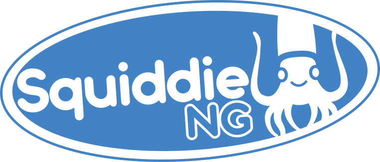

# Squiddie

Squiddie is a Discord chat bot intended to provide music player functionality, in response to numerous bots deprecating YouTube support. 

## Overview

- [Usage](https://github.com/euvaz/squiddie#usage)
- [Installation](https://github.com/euvaz/squiddie#installation)
  - [Configuration](https://github.com/euvaz/squiddie#configuration)
  - [Execution](https://github.com/euvaz/squiddie#execution)
  - [Docker](https://github.com/euvaz/squiddie#docker)
  - [Manual](https://github.com/euvaz/squiddie#manual)
    - [Setup virtual env](https://github.com/euvaz/squiddie#setup-virtual-env)
    - [Activate virtual env](https://github.com/euvaz/squiddie#activate-virtual-env)
- [License](https://github.com/euvaz/squiddie#license)

## Usage

This bot fully utilizes Discord's new Slash commands feature. Commands can be executed by running `/[Command] {Options}`.

Full set of commands and their descriptions can be seen by typing `/help {Options}`:

```
==== Bot Help ====

For more information: /help [command|category]

==== Categories ====
- Music
```

For more detailed information on a category, you can specify the category name.

For example, `/help Music`:

```
==== Category Help ====
Music - No description provided

== Prefix Commands
- play - Searches the query on youtube, or adds the URL to the queue.
- leave - Leaves the voice channel the bot is in, clearing the queue.
- skip - Skips the current song.
- join - Joins the voice channel you are in.
- data - Load or read data from the node.
- resume - Resumes playing the current song.
- stop - Stops the current song (skip to continue).
- pause - Pauses the current song.
- nowplaying - Gets the song that's currently playing.
== Slash Commands
- play - Searches the query on youtube, or adds the URL to the queue.
- leave - Leaves the voice channel the bot is in, clearing the queue.
- skip - Skips the current song.
- join - Joins the voice channel you are in.
- data - Load or read data from the node.
- resume - Resumes playing the current song.
- stop - Stops the current song (skip to continue).
- pause - Pauses the current song.
- nowplaying - Gets the song that's currently playing.
```

## Installation

### Configuration

Firstly, it is necessary to update the environment and application files respectively.

```sh
$ cp .env_sample .env && cp application_sample.yaml application.yaml
```

After copying over the sample files, set their values accordingly.

### Execution

There are two methods of running the bot, [Docker](https://github.com/euvaz/squiddie#docker) (Recommended) or [Manual](https://github.com/euvaz/squiddie#manual). Utilizing the docker method is recommended, as the docker-compose will automatically create a self-hosted [Lavalink](https://github.com/freyacodes/Lavalink) instance.

### Docker

When using this method, be sure to set the following values within `.env`:

```
...
LAVALINK_SERVER = localhost
LAVALINK_PORT = 2333
...
```

Build image and run as daemon:

```sh
$ docker compose up -d
```

If any changes are made to the environment file, the docker compose will need to be stopped, rebuilt, and started again:

```sh
$ docker compose down
$ docker compose build
$ docker compose up -d
```

### Manual

> Poetry is recommended to be used with Python version 3.10.

#### Setup virtual env

1. Install Poetry:

    ```sh
    $ pip3 install -U poetry
    ```

2. Initialize Poetry:
   
    ```sh
    $ poetry init
    ```

#### Activate virtual env

There are two methods for running the project.

1. Inline - Recommended method due to simplicity:
    
    ```sh
    $ poetry run python3 -m squiddie
    ```

2. Out-of-line - Useful for debugging:

    ```sh
    $ poetry shell
    $ python3 -m squiddie
    ```

## License

As of 21-Oct-2021, Squiddie is no longer private, and is now fully open to the public. Contributions are welcome, and appreciated.
Squiddie is now licensed under GPLv2.
